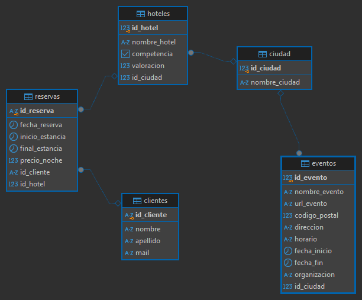

# Proyecto: Proceso ETL para Integración de Datos sobre Hoteles en Madrid 🏨

## 🚀📊 **Descripción del Proyecto** 📝
Este proyecto tiene como objetivo implementar un proceso de Extracción, Transformación y Carga (ETL) para consolidar datos de dos fuentes principales:
    1. Una plataforma de hoteles en Madrid.
    2. Datos de eventos públicos en la Comunidad de Madrid.

Tras la extracción, los datos se almacenan en un destino estructurado para su posterior análisis. Se han utilizado diversas herramientas y tecnologías para garantizar la eficiencia y escalabilidad del proceso.

## 🔹**Componentes del Proceso ETL:**
- **Extracción**: Obtención de datos desde diferentes fuentes (API, Web Scraping con Selenium y archivos CSV).
- **Transformación**: Limpieza y estructuración de los datos aplicando reglas de negocio.
- **Carga**: Almacenamiento de los datos procesados en una base de datos relacional (PostgreSQL).

##  🗄️ Diagrama de la BBDD final


## 🗂️ **Estructura del Proyecto**
```
├── data/
│   ├── raw/
│   │   ├── reservas_hoteles.parquet          # Datos en bruto de reservas
│   ├── eventos_relevantes.pkl                # Eventos en Madrid filtrados por fecha
│   ├── hoteles_competencia.csv               # Datos de hoteles competidores
│   ├── reservas_hoteles_final.pkl            # Datos de reservas limpios
├── notebooks/                            # Jupyter Notebooks con procesos ETL
│   ├── 01_Carga_EDA_Transform.ipynb          # Carga, exploración y limpieza de datos
│   ├── 02_Scrapeo_Selenium.ipynb             # Extracción de datos con Selenium
│   ├── 03_Scrapeo_API.ipynb                  # Extracción de datos mediante API
│   ├── 04_LoadSQL.ipynb                      # Carga de datos a PostgreSQL
│   ├── 05_Bonus_Analisis.ipynb               # Análisis adicional de los datos
├── Querys_SQL/                           # Consultas SQL
│   ├── Bonus1_QuerysSQL.sql                  # Consultas para análisis extra
├── src/                                  # Scripts ETL en Python
│   ├── LoadSQL.py                            # Script para carga de datos
│   ├── Extract.py                            # Extracción de datos (API y Selenium)
│   ├── Transform.py                          # Limpieza y transformación de datos
├── README.md                             # Descripción del proyecto
```


## 🔍 **Tecnologías Utilizadas**
**Lenguajes**: Python, SQL
**Librerías**: Pandas, NumPy, Psycopg2, Matplotlib, Seaborn
**Base de Datos**: PostgreSQL
**Herramientas**: Jupyter Notebook, Selenium, API REST

## 📌 **Conclusiones y Resultados**
El objetivo principal de este proyecto se ha cumplido con éxito, logrando extraer, transformar y cargar los datos en una base de datos relacional. Para futuras iteraciones, se propone:
- Mejorar la modularización del código en scripts Python.
- Reducir el uso de notebooks en favor de scripts reutilizables.
- Optimizar la eficiencia del scraping y procesamiento de datos.

## 🤝 **Contribuciones**
Las contribuciones son bienvenidas. Puedes:
- Abrir un pull request con mejoras.
- Crear una issue para proponer nuevas funcionalidades.

## ✒️ **Autor**

**Agustin Salomon**

## 📌 **Contacto**
https://github.com/aSalomon96

mi LinkedIn https://www.linkedin.com/in/agustin-salomon/


Este proyecto es un ejercicio práctico para mejorar habilidades en ETL y procesamiento de datos. 🚀


